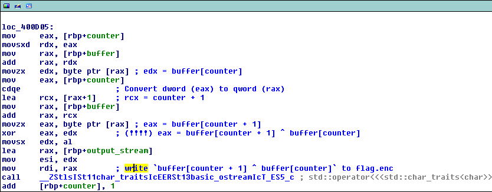

# ASIS Cyber Security Contest Finals 2014: Lion Cub

**Category:** Reverse Engineering
**Points:** 100
**Description:**

> Flag is encrypted using this [program](simple_f0455e55c1d236a28387d04d5a8672ad), can you find it?

## Write-up

Let’s see what [the provided file](simple_f0455e55c1d236a28387d04d5a8672ad) could be:

```bash
$ file simple_f0455e55c1d236a28387d04d5a8672ad
simple_f0455e55c1d236a28387d04d5a8672ad: xz compressed data
```

So, we extract the file using the built-in `xz` or `unxz` commands:

* `xz -dc < simple_f0455e55c1d236a28387d04d5a8672ad > lion-cub`
* `unxz < simple_f0455e55c1d236a28387d04d5a8672ad > lion-cub`

Alternatively, extract the provided file using [p7zip](http://p7zip.sourceforge.net/):

```bash
7z x simple_f0455e55c1d236a28387d04d5a8672ad
```

Let’s find out what the extracted file is:

```bash
$ file lion-cub
lion-cub: gzip compressed data, from Unix, last modified: Sat Oct 11 11:44:23 2014
```

The ASIS CTF organizers sure like compressing files…

```bash
$ gunzip < lion-cub > lion-cub-unzipped

$ file lion-cub-unzipped
lion-cub-unzipped: POSIX tar archive (GNU)

$ tar xvf lion-cub-unzipped
x simple/
x simple/simple_5c4d29f0e7eeefd7c770a22a93a1daa9
x simple/flag.enc

$ cd simple

$ file simple_5c4d29f0e7eeefd7c770a22a93a1daa9
simple_5c4d29f0e7eeefd7c770a22a93a1daa9: xz compressed data

$ unxz < simple_5c4d29f0e7eeefd7c770a22a93a1daa9 > simple

$ file simple
simple: ELF 64-bit LSB executable, x86-64, version 1 (SYSV), dynamically linked (uses shared libs), for GNU/Linux 2.6.26, stripped

$ file flag.enc
flag.enc: data
```

Running the `simple` executable results in an error:

```bash
$ ./simple
terminate called after throwing an instance of 'std::bad_alloc'
  what():  std::bad_alloc
Aborted
```

Let's use `ltrace` to see what goes wrong (with the `-C` option to decode (demangle) C++ function names):

```bash
$ ltrace -C ./simple_2
__libc_start_main(0x400bfc, 1, 0x7fff31dab668, 0x400e50, 0x400e40 <unfinished ...>
std::basic_ifstream<char, std::char_traits<char> >::basic_ifstream(char const*, std::_Ios_Openmode)(0x7fff31dab340, 0x400eec, 14, 4, 0x7f4cabb36320) = 0x7f4cac2c1a98
std::basic_ofstream<char, std::char_traits<char> >::basic_ofstream()(0x7fff31dab140, 4, 0x1872000, 134592, 0x7f4cac4e0720) = 0
std::istream::tellg()(0x7fff31dab340, 0x7f4cac09a560, 6, 6, 0x7f4cac2d8030)                      = -1
operator new[](unsigned long)(-1, 4, 0, -1, 0x7f4cac2d8030 <unfinished ...>
__gxx_personality_v0(1, 1, 0x474e5543432b2b00, 0x7f4ca4000910, 0x7fff31daae30)                   = 8
__gxx_personality_v0(1, 1, 0x474e5543432b2b00, 0x7f4ca4000910, 0x7fff31daae30)                   = 8
__gxx_personality_v0(1, 1, 0x474e5543432b2b00, 0x7f4ca4000910, 0x7fff31daae30)                   = 8
terminate called after throwing an instance of 'std::bad_alloc'
__gxx_personality_v0(1, 1, 0x474e5543432b2b00, 0x7f4ca4000910, 0x7fff31daaba0)                   = 6
__gxx_personality_v0(1, 6, 0x474e5543432b2b00, 0x7f4ca4000910, 0x7fff31daaba0)                   = 7
  what():  std::bad_alloc
--- SIGABRT (Aborted) ---
+++ killed by SIGABRT +++

```

It's trying to open a file. Let's use `strace` to monitor system calls and see which file that is:

```bash
 % strace ./simple_2
...
open("flag", O_RDONLY)                  = -1 ENOENT (No such file or directory)
...
```

Aha! So it's reading the `flag` and then doing stuff with it. We create a `flag` file ourselves with random content. When now running the file, no error message shows up, and the file `flag.enc` is created. Good. Let's reverse how the binary is encrypting the flag. Opening the file in IDA shows that the code is not too overly complicated. We can spot the encryption algorithm by seeing where it writes to file:



So encryption can be summarized as:

	encrypted[counter] = plaintext[counter] ^ plaintext[counter + 1]

This means the last byte will not be encrypted, because otherwise an overflow would occur when accessing the element at `counter +  1`. Hence the last byte in `flag.enc` is not encrypted. With this in mind we can easily reverse decryption:

    plaintext[counter] = encrypted[counter] ^ plaintext[counter + 1]

Eventually we end up with this Python script that decrypts anything encrypted by the `simple` file.

```python
#!/usr/bin/env python
# coding=utf-8
FILE_IN = 'flag.enc'
FILE_OUT = 'flag.dec'

def decrypt():
    data = [ord(c) for c in open(FILE_IN, 'rb').read()]

    # We know data[len(data) - 1] is already plaintext (as it was not encrypted)
    for i in reversed(xrange(len(data) - 1)):
        data[i] = data[i] ^ data[i + 1]

    decrypted = ''.join([chr(b) for b in data])

    f = open(FILE_OUT, 'wb')
    f.write(decrypted)
    f.close()

decrypt()
```

Running the script writes the result to a file named `flag.dec`. Let’s find out what kind of file it is:

```bash
$ file flag.dec
flag.dec: gzip compressed data, was "flag.png", from Unix, last modified: Sat Oct  4 08:26:43 2014
```

Oh no, more compression!

```bash
$ gunzip < flag.dec > flag
gunzip: truncated input

$ file flag
flag: PNG image data, 327 x 327, 1-bit colormap, non-interlaced
```

The `flag` file is a PNG image that displays a QR code, that decodes to the following:

```
1f8b0808928d2f540003666c61672e706e67000192016dfe89504e470d0a
1a0a0000000d494844520000006f0000006f0103000000d80b0c23000000
06504c5445000000ffffffa5d99fdd0000000274524e53ffffc8b5dfc700
0000097048597300000b1200000b1201d2dd7efc0000012449444154388d
d5d431ae84201006e079b1a0d30b90cc35e8b8925e40e5027a253aae41e2
05b0a320ce1bb2bbef651b87668b25167e0501867f007a1bf01d4c004be8
76af0150e449650a71087aa1067afee9762aa36ae2a8746f7523674bbb2f
4de4250c12fd6ff2867cde2968fefe8e7f431e17943af155d81b26d06068
b3dd661a68d005987cfc219997e23b8ab3c24bc9a4808e3acab4da065204
a541e166506402e4592ec71148e499cbe0f914b42a99c91eb59221824591
e4613475b9dd93c804e4087a13472bf3ac05e7781f6b0b0326551be77147
02b35e38540a0064f2481c6fc2d3cbe4c472bc5dd613c9e45e98a10c19cf
576bdc915b9213cbbb524d9c88d73ab667ad44d667e419957b72ffdace79
bc8ccc47fff696eb2ff3734feea7f80bb686232e7a493424000000004945
4e44ae426082fb73fb8e92010000
```

Let’s save that to `decoded.txt`. Then, since the contents are all in hex, maybe this represents a file?

```bash
$ xxd -r -p decoded.txt > decoded.bin

$ file decoded.bin
decoded.bin: gzip compressed data, was "flag.png", from Unix, last modified: Sat Oct  4 08:02:58 2014
```

Here we go again…

```bash
$ gunzip < decoded.bin > decoded

$ file decoded
decoded: PNG image data, 111 x 111, 1-bit colormap, non-interlaced
```

`decoded` is another PNG image that once again displays a QR code. Luckily, this time it decodes to the flag: `ASIS_e87b556efc59f8351aec0858da850906`.

## Other write-ups and resources

* none yet
